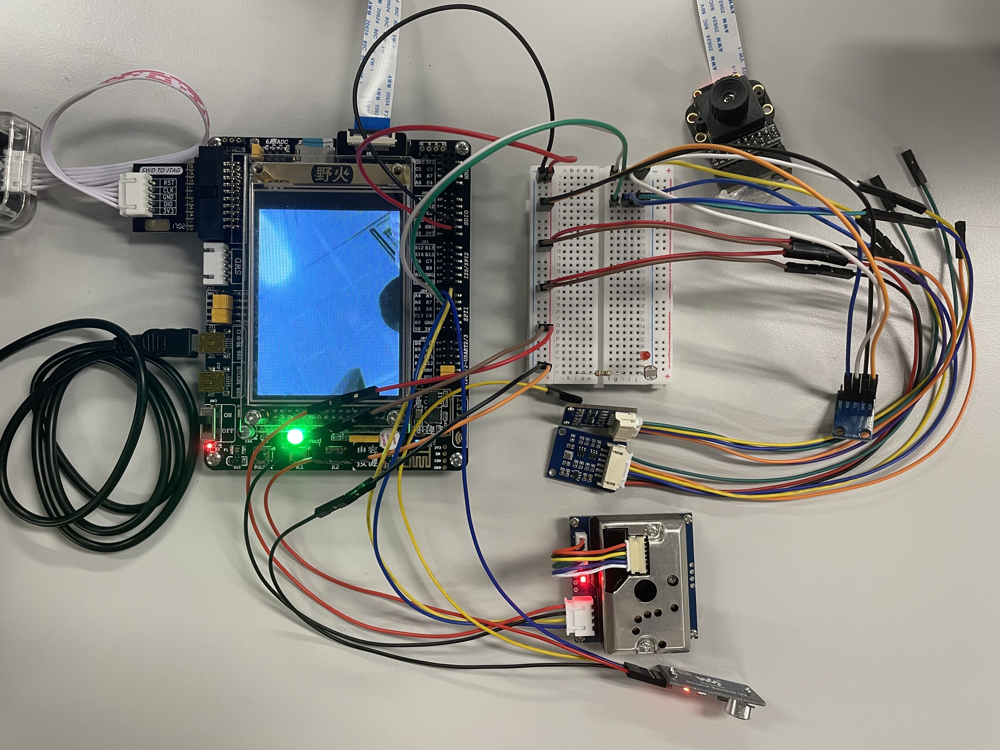

# IoT-Smart-Env-Tracker

## Overall View

## Demo Video

## Features
- [x] Temperature measurement using BME280 (I2C).
- [x] Humidity measurement using BME280 (I2C).
- [x] Barometric pressure measurement using BME280 (I2C).
- [x] Compass functionality using HMC5883L (I2C).
- [x] UV measurement using LTR390-UV-01 (I2C).
- [x] Ambient light measurement using LTR390-UV-01 (I2C).
- [x] Ambient sound detection using LM386 (ADC).
- [x] PM2.5 measurement using GP2Y1014AU0F (ADC).
- [x] Embedded LED to display device status (GPIO).
- [x] Photo taking (SCCB).
- [x] Environment measurement data and photos can be displayed on LCD (FSMC).
- [x] Environment measurement data and photos can be stored in SD card (SDIO, DFS).
- [ ] LCD auto-adjusts brightness according to ambient light (I2C, PWM).
- [ ] GUI and touch control (FSMC, SPI).
- [ ] ESP8266 Wi-Fi connection (UART, AT Commands).
- [ ] Real time clock is enabled, and the board can synchronize time with cloud server through Internet (RTC, SNTP).
- [ ] Internet-of-Things. The board can communicate with cloud server through Internet via TCP protocol. It can send data to the server and receive command from the server (UART, TCP, AT Commands).
- [ ] Hot-swapping pins. There are some pins used by both camera ov7725 and ESP8266. The system can configure the correct states for the pin for each component during run time (UART, GPIO).
- [x] RTOS integration.
- [x] System crash detection and auto reboot (IWDG).

## CubeMX Config

## Dependencies
- [RT-Thread (RTOS) v4.0.5](https://github.com/RT-Thread/rt-thread)
  - DFS
  - FATFS
  - ULog
  - Posix
  - Libc
  - Serial
  - Pin
  - Soft I2C
  - SDIO
<!-- - [Bosch Sensortec BME280 sensor driver v3.3.4](https://github.com/BoschSensortec/BME280_driver) -->
<!-- - [LVGL (GUI library)](https://github.com/lvgl/lvgl) -->

## How to build
See [RT-Thread documentation](https://www.rt-thread.io/document/site/programming-manual/env/env/).
